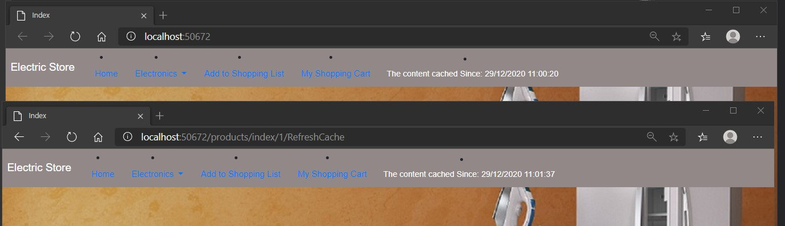

# Module 12: Performance and Communication

## Lab: Performance and Communication

1. **Nombres y apellidos:** Francisco Javier Moreno Quevedo
2. **Fecha:** 02/12/2020
3. **Resumen del Ejercicio:** implementar la cache y el MemoryCache en el proyecto
4. **Dificultad o problemas presentados y como se resolvieron:** Ninguna

Ejercicio 1: Implementing a Caching Strategy

- Añadimos las depnedencias al proyecto con npm Install

- En el _layout.cshtml añadimos los elementos cacheables

- Creamos la clase **NavbarMenuViewComponent.cs**

- Creamos la vista **MenuCategories.cshtml**

- Ejecutamos

  

- En el **ProductsController.cs** 

  - Modificamos el constructor inyectando el IMemoryCache
  - Modificamos la acción index para que devuelva la lista de productos

- Modificamos la vista **Index.cshtml** de Products para que visualice los productos

- Ejecutamos

  

